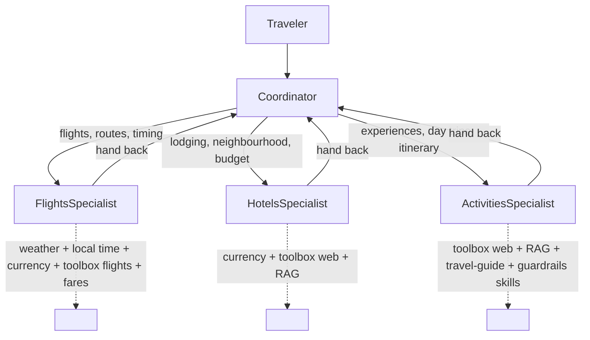

# Step 7 — Multi-agent: hand off to specialists at runtime

> **Goal:** split TravelBuddy into a **Coordinator** plus **Flights / Hotels / Activities** specialists that the Coordinator hands the active turn to as the conversation unfolds — while the Coordinator and its specialists each reuse a slice of the Step 6 tools, toolbox, RAG, and skills.

> **Tip — give this step a capable model.** Step 7 is the most demanding step for the model: the Coordinator and three specialists share one conversation, and every handoff replays the accumulated history plus each specialist's tool output, so the context grows fast. A small `-mini` deployment (for example `gpt-4o-mini`) often starts skipping handoffs, asking the traveler directly, or losing the routing thread. If handoffs misbehave, point `AZURE_AI_MODEL_DEPLOYMENT_NAME` at a full-size model — for example a `gpt-5.4` deployment rather than `gpt-5.4-mini` — and re-run. It's a deployment-name change only; no code changes.

## What you'll learn

- The Agent Framework's native multi-agent primitives — `SequentialBuilder`, `ConcurrentBuilder`, and `HandoffBuilder`
- When **runtime handoff** beats a fixed workflow: dynamic, user-driven branching where the next expert isn't known in advance
- How to give each agent a narrow capability slice from the carried stack (tools, toolbox, RAG, skills)
- How `workflow.as_agent()` exposes the whole graph as one hosted agent, so deployment is unchanged (`resources: []`, no `azd provision`)

## What's already in the repo

- Everything from Steps 1–6 in `travel_assistant/` — the three function tools, the Foundry Toolbox, the Step 5 RAG provider, and the Step 6 itinerary skill. Nothing was deleted when you advanced.
- `travel_toolbox/toolbox.yaml` — the toolbox definition, still a sibling of `travel_assistant/`.
- `travel_assistant/agents/{flights,hotels,activities}/` — the per-specialist config slices (`agent.yaml` + `agent.manifest.yaml`), delivered complete when you advanced. You **read** these; you don't edit them.
- `travel_assistant/coordinator.py` — a starter scaffold with `TODO`s that you fill in below.

In this step you make **delta-only** edits: read the per-specialist config slices under `agents/`, build the handoff graph in `coordinator.py`, and point `main.py` at the Coordinator. There are **no** new environment variables and no manifest env changes — only a `Multi-Agent` tag and a `handoff` metadata block.

## Concept (5-min read)

A single-agent assistant is the simplest shape: one instruction set, one tool list, one history, one model deciding every step. That's great while TravelBuddy's job is narrow. As it grows, the prompt starts carrying too many responsibilities — flight trade-offs, hotel constraints, destination grounding, itinerary generation, web lookups, and user-facing coordination all at once.

A **multi-agent runtime** keeps one conversation but splits responsibilities into focused agents. The **Coordinator** speaks first, decides what the traveler is asking for, and hands the active turn to the specialist that owns the next part of the answer. A specialist uses only the capabilities it needs, then hands control back to the Coordinator when the topic changes or the answer needs synthesis.

**Handoff vs. workflow.** The Agent Framework gives you several shapes:

- `SequentialBuilder` passes work through agents in a fixed order.
- `ConcurrentBuilder` fans the same task out to several agents and aggregates the results.
- `HandoffBuilder` is the **runtime-collaboration** shape we use here — the active agent transfers control to another participant when the conversation calls for a different specialist.

Handoff wins when the *user* drives the path and the next expert isn't known until the conversation unfolds. A **workflow** (Step 8) wins when the process is known ahead of time: gather → specialists → approve → finalize. This step is runtime collaboration; Step 8 re-expresses the same trip-planning scenario as a durable, observable pipeline.

The important design choice isn't the number of agents — it's the **boundary** around each one. Each specialist gets a short purpose statement, a narrow capability slice, and a clear rule about when to hand back. Those slices come straight from the carried stack:



**One hosted agent, or many? (in-process vs. A2A).** Notice all four agents live in the *same* process and share one `FoundryChatClient`; `workflow.as_agent()` then wraps the whole graph as a **single** hosted agent — so deployment is unchanged (`resources: []`, no `azd provision`). Handoffs are in-memory function calls: fast, simple, and easy to trace. The alternative is to deploy each specialist as its **own** hosted agent and have the Coordinator reach them remotely over the **A2A (Agent-to-Agent) protocol** (or expose one deployed agent as a function tool of another). Remote agents can be scaled, versioned, owned, and reused independently — even across teams, languages, or vendors — but every handoff now pays a network hop plus auth and serialization cost, and you operate N deployments instead of one. Rule of thumb: keep chatty, tightly-coupled specialists **in-process** (what we do here); reach for **A2A** only when a specialist genuinely needs to be independently deployed or reused. The two compose — a hosted agent like this one can itself be a node in a larger A2A mesh.

**Learn more**

- [Handoff orchestration in Microsoft Agent Framework](https://learn.microsoft.com/agent-framework/user-guide/agent-orchestration/handoff)
- [Agent orchestration overview](https://learn.microsoft.com/agent-framework/user-guide/agent-orchestration/)
- [Using workflows as agents](https://learn.microsoft.com/agent-framework/user-guide/workflows/workflows-as-agents)
- [Agent-to-Agent (A2A) protocol in Microsoft Agent Framework](https://learn.microsoft.com/agent-framework/journey/agent-to-agent)
- [Connect to an A2A agent endpoint from Foundry Agent Service](https://learn.microsoft.com/azure/foundry/agents/how-to/tools/agent-to-agent)
- [Agent Framework `handoff_workflow_as_agent.py` sample](https://github.com/microsoft/agent-framework/blob/main/python/samples/03-workflows/agents/handoff_workflow_as_agent.py) — the canonical handoff sample this step follows (a `HandoffBuilder` graph exposed through `workflow.as_agent()`).

## Steps

### 1. Read the specialist config slices

The per-specialist config slices are **already in the repo** — one folder per specialist under `travel_assistant/agents/`, delivered complete when you advanced. Each folder holds an `agent.yaml` (the role, `description`, and `instructions`) and an `agent.manifest.yaml` (the capability slice: `tools`, `rag`, `skills`). You don't edit them here — **open and read them**, because in the next section you translate each one into the code that builds that specialist.

```text
travel_assistant/agents/
├── flights/     { agent.yaml, agent.manifest.yaml }   # weather + local time + currency + toolbox flights (fares)
├── hotels/      { agent.yaml, agent.manifest.yaml }   # currency + toolbox web + destinations RAG
└── activities/  { agent.yaml, agent.manifest.yaml }   # toolbox web + destinations RAG + travel-guide/guardrails skills
```

Reading them, notice the intended boundary of each specialist:

- **Flights** — the three function tools (`get_weather`, `get_local_time`, `convert_currency`) plus the toolbox (its flight search); it always reports concrete fares. No RAG, no skills.
- **Hotels** — `convert_currency`, the toolbox (its web search for live rates and availability signals), and the destinations index (RAG).
- **Activities** — the toolbox (web search), the destinations index (RAG), **and** the two skills that shape the final deliverable: the LOCAL `travel-guide` skill (renders the shareable PDF trip guide) and the Foundry `response-guardrails` skill. In this runtime-handoff step the skills ride on a **leaf** specialist, not the Coordinator (see the callout below).

Three small slices make each specialist's intended boundary explicit and easy to review — they're the architecture spec a teammate reads before touching the graph.

> **The Foundry skill is optional here.** The **Activities** specialist owns the two skills that shape the final answer — the LOCAL `travel-guide` skill (renders the shareable PDF trip guide) and the Foundry `response-guardrails` skill carried from Step 6 — and the checked-in **solution is the Foundry-enabled reference**: its `coordinator.py`, `ACTIVITIES_INSTRUCTIONS`, and `.env.example` all wire the guardrails skill in and treat it as required. If you built it in Step 6, keep it: serve both skills from your skills provider and keep the "always apply `response-guardrails`" line in `ACTIVITIES_INSTRUCTIONS`. If you **skipped** the Foundry skill (for example your Foundry project can't allow public network access — see Step 6), leave `FOUNDRY_SKILL_NAMES` unset, drop the `response-guardrails` line from `ACTIVITIES_INSTRUCTIONS`, and serve only the local `travel-guide` skill — carry your Step 6 *local-only* skills provider rather than the solution's Foundry-enabled `_build_skills_provider`. The local `travel-guide` skill still renders the PDF and nothing else in this step depends on the Foundry skill. In practice, if you couldn't build the Foundry skill in Step 6 you already made your skills provider treat it as optional there — just carry that same local-only provider forward; there's nothing extra to redo here.

> **Why the skills ride on Activities, not the Coordinator.** A skills provider is a **context provider that registers its skill *tools*** on whichever agent holds it. In a runtime handoff the Coordinator is the only participant invoked **twice** — once to route, then again to synthesize after a specialist hands back — and with `default_options={"store": False}` the framework replays the whole tool-call history on that second call. Attaching a **tool-producing** context provider (the skills provider) to the Coordinator desyncs that replay and the service rejects it (`400 No tool call found for function call output`). Leaf specialists are invoked **once**, so they carry context providers safely — which is why the skills live on the Activities leaf here. The trade-off: only Activities' output is guarded, not the Coordinator's final synthesis, and the Coordinator has to *route* the deliverable through Activities rather than being *structurally* forced to. That's a real limitation of a pure router, and it's exactly what **Step 8** fixes — its workflow adds a dedicated `finalize` node that owns the deliverable and guards the actual final answer.

> **These slices are documentation, not runtime config.** Nothing loads `agent.yaml`/`agent.manifest.yaml` at run time. In the next section `coordinator.py` builds each specialist directly in Python: the `instructions:` become string constants and the tool/RAG/skill slices become hand-written `tools=[...]` and `context_providers=[...]` arguments. The slices are the reviewable **contract**; `coordinator.py` is the executable **source of truth**. That means they can drift, so when a specialist behaves unexpectedly, inspect `coordinator.py` first — then realign the slice so the two agree.

### 2. Build the handoff graph in `coordinator.py`

The Coordinator is the only agent the traveler intentionally talks to. `coordinator.py` ships as a starter scaffold with `TODO`s — you fill in the instruction constants and the per-specialist capability slices, while the handoff graph below comes pre-wired. `HandoffBuilder` registers the participants, generates the handoff tools, sets the start agent as the entry point, and defines which agents may hand off to which. It lives in `agent_framework.orchestrations` — a separate `agent-framework-orchestrations` package, already added to `requirements.txt` for this step. Each specialist is a normal `Agent` — the same constructor from Steps 4–6 — with a sliced `tools` list and, where relevant, sliced `context_providers` (RAG for Hotels and Activities, plus the skills provider for the Activities leaf). This is where the `agents/*/agent.yaml` slices become executable: their `instructions:` turn into the string constants below, and their tool/RAG/skill lists into the hand-written `tools=[...]`/`context_providers=[...]` arguments.

**Why every participant sets `require_per_service_call_history_persistence=True`.** Normally the framework only persists a completed request/response pair to conversation history. But a handoff fires *mid-turn*: the active agent calls a generated handoff tool, and control transfers to the next participant before that tool call resolves. With the default setting that in-flight, unresolved call would be dropped, leaving a gap the next participant can't reason over. The flag tells each agent to persist history on **every service call** — including the partial one interrupted by the handoff — so the receiving specialist sees the full context. `HandoffBuilder.build()` validates this and raises a `ValueError` if any participant is missing the flag, so set it on the Coordinator and all three specialists.

**Now open `travel_assistant/coordinator.py` and fill in its `TODO`s using the slices you just read.** The scaffold constructs the `Coordinator` and imports the essentials; as you carry your Step 5 RAG and Step 6 skills providers over, add any imports they need (for example `Path`, your skills-provider type). You supply:

- the three **specialist** instruction constants (`FLIGHTS_`, `HOTELS_`, `ACTIVITIES_INSTRUCTIONS`) — copy each specialist's `instructions:` block from its `agents/<name>/agent.yaml`;
- the **`COORDINATOR_INSTRUCTIONS`** constant — there's no Coordinator slice, so you write this one. It's the router's brief; make it cover:
  - **Role:** you are TravelBuddy's Coordinator — understand the request, route work to the right specialist, and synthesize a single clear answer.
  - **Routing rules,** one line per specialist, matching each slice's `description`: Flights → timing, airports, routes, layovers, weather risk, fares; Hotels → lodging areas, budgets, amenities, neighbourhood trade-offs; Activities → experiences, day trips, destination guidance, day-by-day itineraries.
  - **Full-trip behaviour:** for a complete plan, gather flight and hotel details first, then hand to the **Activities** specialist **last** with the full draft — it owns the `travel-guide` (PDF) and `response-guardrails` skills, so it produces the final deliverable and runs the guardrail check. Return that guarded result without rewriting it.
  - **Conversation etiquette:** you are the only agent who talks to the traveler, so when a specialist hands back because a detail is missing, ask the traveler yourself rather than routing straight back to that specialist (which can loop); ask a clarifying question only when a missing detail blocks the next useful step, and let the traveler know when you're routing to a specialist.
- the carried `search` RAG provider (from Step 5) for Hotels and Activities, and the `skills` provider (from Step 6) for the **Activities** specialist — that leaf owns the `travel-guide` + `response-guardrails` skills (a handoff Coordinator can't carry a context provider — see the callout above);
- the three specialist `Agent(...)`s — translate each `agents/<name>/agent.manifest.yaml` slice into `tools=[...]` and `context_providers=[...]` (function tools + toolbox → `tools`; `rag` → `search`). The Activities manifest also carries the two `skills`; attach the `skills` provider alongside its `search` provider (`context_providers=[search, skills]`). The Coordinator itself is a **pure router** — no tools, no context providers.

The `HandoffBuilder` graph and its `return workflow.as_agent()` are **already wired in the scaffold** — it references `flights`, `hotels`, and `activities`, so once you define those three specialists the Coordinator is complete.

Set `require_per_service_call_history_persistence=True` on the Coordinator **and** all three specialists (see the callout above), or `build()` will raise. Also carry `default_options={"store": False}` over to every participant, exactly as in Steps 1–6 — the hosting layer manages history, so none of the agents should persist their responses server-side.

The pre-wired graph edges are what make this a handoff rather than a fixed pipeline:

- `with_start_agent(coordinator)` sends each new user request to the Coordinator first.
- `add_handoff(coordinator, [flights, hotels, activities])` lets the Coordinator pick a specialist.
- `add_handoff(flights, [coordinator])` (and the hotel/activity edges) let specialists return control for synthesis or another branch.
- `workflow.as_agent()` wraps the multi-agent runtime so the rest of the app treats it like a single hosted agent.

Because the toolbox is one bundle (web search + Code Interpreter + OctoTrip flights), Flights, Hotels, and Activities each receive the whole toolbox; the tighter boundary — flight search for Flights, web search for Hotels and Activities — is enforced by each specialist's instructions.

### 3. Point `main.py` at the Coordinator

`main.py` collapses to constructing the Coordinator and hosting it through the same adapter as before. Edit your existing `travel_assistant/main.py` in place:

- **Import** `build_travel_coordinator` from `coordinator` (instead of your Step 6 agent builder).
- In `main()`, **build the agent** with `agent = build_travel_coordinator()` — the handoff graph, exposed as one agent — and host it with `ResponsesHostServer(agent).run()`, exactly as before.

Everything else in `main.py` is unchanged. If you moved the `run_local_skill_script` runner and the skill-download helpers into `coordinator.py`, delete their now-unused copies from `main.py`.

### 4. Update the manifest

Metadata-only: append the `Multi-Agent` tag to your existing `tags` (if you kept the Foundry skill you'll also already have `Foundry Skills` from Step 6), update the `description`, and add a `handoff` block naming the coordinator + specialists. No new `template.environment_variables`; `resources` stays `[]`.

```yaml
# travel_assistant/agent.manifest.yaml (delta)
metadata:
  tags: [Agent Framework, AI Agent Hosting, Azure AI AgentServer, Responses Protocol, Travel Assistant, Function Tools, MCP Tools, Toolbox Tools, RAG, Skills, Multi-Agent]
  handoff:
    coordinator: Coordinator
    specialists: [FlightsSpecialist, HotelsSpecialist, ActivitiesSpecialist]
```

## Run and deploy TravelBuddy

`azd ai agent init` **copies** your `travel_assistant/` code into the generated `${WORKSHOP_RESOURCE_PREFIX}-travel-buddy/` project folder — that copy is the snapshot azd builds and deploys. You changed code in `travel_assistant/`, so **re-init** to refresh the snapshot. There are **no** new variables to `azd env set` (reuse the azd environment from earlier steps) and you do **not** run `azd provision` — you added no Azure resource (`resources:` is still `[]`, and no new project role is required).

1. **Re-init from the repository root.** Load your `.env` into the shell first so `WORKSHOP_RESOURCE_PREFIX` expands:

   <!-- terminal -->
   ```bash
   # bash / zsh
   set -a; source .env; set +a
   azd ai agent init -m travel_assistant/agent.manifest.yaml \
     --agent-name "${WORKSHOP_RESOURCE_PREFIX}-travel-buddy"
   ```

   <!-- terminal -->
   ```powershell
   # PowerShell
   Get-Content .env | Where-Object { $_ -match '^\s*[^#].*=' } | ForEach-Object {
     $name, $value = $_ -split '=', 2
     Set-Item "Env:$($name.Trim())" $value.Trim().Trim('"').Trim("'")
   }
   azd ai agent init -m travel_assistant/agent.manifest.yaml `
     --agent-name "$($env:WORKSHOP_RESOURCE_PREFIX)-travel-buddy"
   ```

2. **Run TravelBuddy locally** and invoke the Coordinator from a second terminal:

   <!-- terminal -->
   ```bash
   # terminal 1 — from the project folder:
   cd "${WORKSHOP_RESOURCE_PREFIX}-travel-buddy"
   azd ai agent run
   ```

   <!-- terminal -->
   ```bash
   # terminal 2 — ask for a full trip plan:
   azd ai agent invoke --local "Help me plan a 5-day Tokyo trip: flights from Lisbon, a hotel near Shibuya under €200/night, and a day-trip suggestion."
   ```

   A good trace shows the Coordinator routing to more than one specialist — depending on log level you may see explicit handoff events, specialist names in the messages, or per-specialist tool calls. Prefer a UI? With the local agent still running, open the **Agent Inspector** from the Foundry Toolkit (Command Palette → **Foundry Toolkit: Open Agent Inspector**).

3. **Deploy to Foundry** and invoke the deployed agent:

   <!-- terminal -->
   ```bash
   azd deploy
   azd ai agent invoke "Help me plan a 5-day Tokyo trip: flights from Lisbon, a hotel near Shibuya under €200/night, and a day-trip suggestion."
   ```

   `azd deploy` builds the container image from the **refreshed** snapshot, pushes it, and rolls out a new hosted agent version. The whole handoff graph deploys **inside** the single container, so nothing else is needed — no role grant, no `azd provision`.

## Try it

- `Help me plan a 5-day Tokyo trip: flights from Lisbon, a hotel near Shibuya under €200/night, and a day-trip suggestion.` → expect handoffs between all three specialists.
- `Just the hotel — Reykjavik next weekend, must have a view.` → expect a direct handoff to Hotels.
- `I already booked flights to Rome. Build a relaxed food-and-history itinerary with one day trip.` → expect Activities, not Flights.
- `Can you keep the whole Lisbon weekend under 600 EUR including hotel and activities?` → expect Hotels and Activities, with currency math.

## Troubleshooting

### Coordinator doesn't hand off

Specialist `description` + `instructions` decide when they're chosen. Make each purpose unambiguous and each name descriptive. If the Coordinator answers everything itself, strengthen its routing rules. A weak model can also be the cause: on this multi-agent step the shared context grows quickly, and `-mini` deployments often drop handoffs — if your prompts already look right, try a full-size model deployment (see the model tip at the top of this step).

### Tool not available to a specialist

Each specialist gets only the capabilities you pass it in `coordinator.py` (and documents them in its `agents/*/agent.manifest.yaml` slice). Add the tool to the specialist that needs it and restart the server so the graph is rebuilt.

### Specialist answers outside its lane

Tighten that specialist's boundary text — e.g. Flights should explicitly say it does not choose hotels or activities. A narrow prompt is often more effective than more routing logic.

### Imports fail after adding `coordinator.py`

Keep import names aligned with the files you created in Steps 5–6. `coordinator.py` reuses `tools.py`, the `AzureAISearchContextProvider` wiring from Step 5, and the `run_local_skill_script` runner from Step 6 — if you renamed any of those, update the imports.

### Deploy didn't pick up my change

`azd ai agent init` **copied** your code into `${WORKSHOP_RESOURCE_PREFIX}-travel-buddy/`. Re-run `azd ai agent init` to refresh the snapshot, then `azd deploy` again.

## Solution

> If you get stuck: [`.workshop/solutions/07-multi-agent/`](.workshop/solutions/07-multi-agent/)

## Upstream sample

> The Foundry hosted-agents `responses/` gallery has no dedicated handoff sample, so this step follows the Agent Framework [handoff orchestration](https://learn.microsoft.com/agent-framework/user-guide/agent-orchestration/handoff) docs and the canonical handoff samples in the Agent Framework repo: [`handoff_workflow_as_agent.py`](https://github.com/microsoft/agent-framework/blob/main/python/samples/03-workflows/agents/handoff_workflow_as_agent.py) — which, like this step, exposes a `HandoffBuilder` graph through `workflow.as_agent()` — plus [`handoff_simple.py`](https://github.com/microsoft/agent-framework/blob/main/python/samples/03-workflows/orchestrations/handoff_simple.py) and [`handoff_autonomous.py`](https://github.com/microsoft/agent-framework/blob/main/python/samples/03-workflows/orchestrations/handoff_autonomous.py) ([full orchestrations gallery](https://github.com/microsoft/agent-framework/tree/main/python/samples/03-workflows/orchestrations)). Step 8 re-expresses the same scenario using the workflow pattern from [`05-workflows`](https://github.com/microsoft-foundry/foundry-samples/tree/main/samples/python/hosted-agents/agent-framework/responses/05-workflows).
